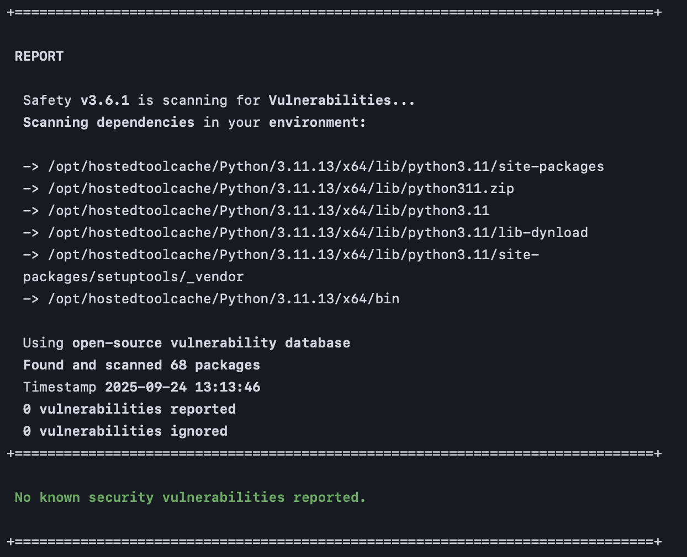

## Описание проекта

Данный проект представляет собой простейшее веб-приложение на **Python** с использованием **Flask**.
Приложение использует **SQLite** как хранилище данных, а для аутентификации применяются **JWT-токены**.  

Возможности:
- Регистрация пользователей
- Авторизация и получение JWT
- Доступ к защищённому ресурсу (списку всех пользователей)

---

## API

### 1. Регистрация пользователя
**POST** `/auth/register`

**Тело запроса (JSON):**
```json
{
  "login": "username",
  "password": "password"
}
```

**Ответ при успешной регистрации**
```json
{
  "message": "User registered successfully"
}
```

**Пример ответа при неудачной регистрации**
```json
{
  "error": "User username already exists"
}
```

### 2. Авторизация пользователя
**POST** `/auth/login`

**Тело запроса (JSON):**
```json
{
  "login": "username",
  "password": "password"
}
```

**Ответ при успешной авторизации**
```json
{
  "message": "Login successful",
  "token": "<jwt_token>"
}
```


**Пример ответа при неудачной авторизации**
```json
{
  "error": "Invalid login or password"
}
```

### 2. Авторизация пользователя
**POST** `/auth/login`

**Тело запроса (JSON):**
```json
{
  "login": "username",
  "password": "password"
}
```

**Ответ при успешной авторизации**
```json
{
  "message": "Login successful",
  "token": "<jwt_token>"
}
```

**Пример ответа при неудачной авторизации**
```json
{
  "error": "Invalid login or password"
}
```

### 3. Получение списка всех пользователей
**POST** `/api/data`

**Обязательные заголовки:**
```
Authorization: Bearer <jwt_token>
```

**Пример успешного ответа**
```
[
  {"id": 1, "login": "user1"},
  {"id": 2, "login": "user2"},
  {"id": 3, "login": "user3"}
]
```

**Ответ при ошибке аутентификации**
```json
{
  "error": "Invalid or expired token"
}
```

## Реализованные механизмы защиты

### 1. Защита от SQL инъекций
- Нет динамической конкатенации строк в SQL
- Вставка параметров реализована через ? плейсхолдеры
Пример:
```
return db.execute("SELECT * FROM users WHERE login = ?", (login,)).fetchone()
```

### 2. Защита от XSS
- Все отправляемые пользователю значения, которые были ранее им присланы, экранируются с помощью `markupsafe.escape()`
В данном примере, каждый логин был получен непосредственно от пользователя, поэтому перед тем, как отправить список логинов, их все нужно экранировать.
```
[{"id": u["id"], "login": escape(u["login"])} for u in users]
```

### 3. Используются JWT-токены
- Защищенный эндпоинт пребует заголовка с JWT-токеном, который выдается при авторизации.
- Используемый алгоритм - HS256, время жизни токена - 24 часа.
- Реализован декоратор `jwt_required`, с помощью которого можно обернуть функцию так, что перед ее исполнением будет проверен JWT-токен.

### 4. Хеширование паролей
- Используется `werkzeug.security.generate_password_hash` c алгоритмом PBKDF2-HMAC-SHA256.
- Для проверки пароля используется функция `werkzeug.security.check_password_hash`.

## Запуск проекта
```
# Установка зависимостей
pip install -r requirements.txt

# Установка переменных окружения (либо же их можно указать в файле .env в корне проекта)
export FLASK_SECRET_KEY="your_flask_secret"
export JWT_SECRET_KEY="your_jwt_secret"

# Запуск приложения
python3 app.py
```

### CI/CD 
В проект интегрированы статический и компонентный анализ кода (SAST/SCA) через GitHub Actions.

**Проверяется:**
- Использование небезопасных функций (например, конкатенация строк в SQL запросах)
- Проверка зависимостей на наличие известных уязвимостей
- Ошибки конфигурации безопасности (например, ключи в коде)

**Пример отчетов**
`safety`



`bandit report json`
```
{
  "errors": [],
  "generated_at": "2025-09-24T13:08:41Z",
  "metrics": {
    "./app.py": {
      "CONFIDENCE.HIGH": 0,
      "CONFIDENCE.LOW": 0,
      "CONFIDENCE.MEDIUM": 1,
      "CONFIDENCE.UNDEFINED": 0,
      "SEVERITY.HIGH": 1,
      "SEVERITY.LOW": 0,
      "SEVERITY.MEDIUM": 0,
      "SEVERITY.UNDEFINED": 0,
      "loc": 42,
      "nosec": 0,
      "skipped_tests": 0
    },
    "./auth.py": {
      "CONFIDENCE.HIGH": 0,
      "CONFIDENCE.LOW": 0,
      "CONFIDENCE.MEDIUM": 0,
      "CONFIDENCE.UNDEFINED": 0,
      "SEVERITY.HIGH": 0,
      "SEVERITY.LOW": 0,
      "SEVERITY.MEDIUM": 0,
      "SEVERITY.UNDEFINED": 0,
      "loc": 31,
      "nosec": 0,
      "skipped_tests": 0
    },
    "./db.py": {
      "CONFIDENCE.HIGH": 0,
      "CONFIDENCE.LOW": 0,
      "CONFIDENCE.MEDIUM": 0,
      "CONFIDENCE.UNDEFINED": 0,
      "SEVERITY.HIGH": 0,
      "SEVERITY.LOW": 0,
      "SEVERITY.MEDIUM": 0,
      "SEVERITY.UNDEFINED": 0,
      "loc": 29,
      "nosec": 0,
      "skipped_tests": 0
    },
    "_totals": {
      "CONFIDENCE.HIGH": 0,
      "CONFIDENCE.LOW": 0,
      "CONFIDENCE.MEDIUM": 1,
      "CONFIDENCE.UNDEFINED": 0,
      "SEVERITY.HIGH": 1,
      "SEVERITY.LOW": 0,
      "SEVERITY.MEDIUM": 0,
      "SEVERITY.UNDEFINED": 0,
      "loc": 102,
      "nosec": 0,
      "skipped_tests": 0
    }
  },
  "results": []
}
```
